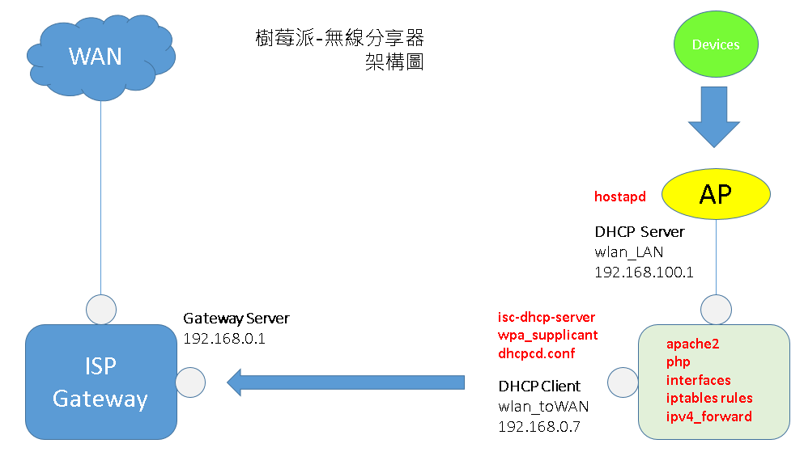
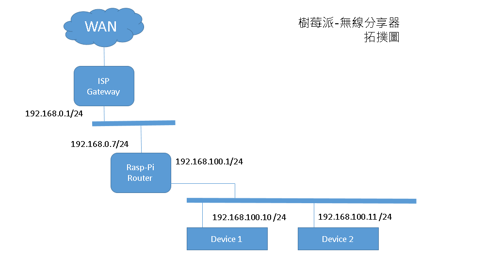

# 樹莓派 RPI router(Repeater) 專題


## 前置準備硬體、軟體、配件

為了做一個 有 AP 功能的無線 IP 分享器，需要以下設備來開發

Raspberry Pi 3 model B

micro SD 8G 以上 (class 10)

USB 鍵盤

HDMI 螢幕

電腦

電源

wifi USB adapter (dongle)

#### 初始設定

需要用到 HDMI 螢幕跟 USB 鍵盤

* 安裝作業系統到 flash SD 裡面

下載 raspbian 無 X window 版本

[https://www.raspberrypi.org/](https://www.raspberrypi.org/)

```
RASPBIAN STRETCH LITE
Minimal image based on Debian Stretch
Version:September 2017
Release date:2017-09-07
Kernel version:4.9
Release notes:Link
SHA-256:bd2c04b94154c9804cc1f3069d15e984c927b750056dd86b9d86a0ad4be97f12
```

另外再下載 hash 比對器，確定檔案來源

[install guide](https://www.raspberrypi.org/documentation/installation/installing-images/README.md)

另外再去下載 SD card formatter 跟燒映像檔的 Etcher

格式化記憶卡再燒錄映像檔，燒錄完成之後直接裝上 pi , 然後開機 , 

順便把鍵盤跟 HDMI 接上 pi , 開機完之後輸入預設的帳號密碼進入系統


*  Ehternet RJ45 連接網路

進入系統之後 , 沒有網路很多東西都無法安裝跟更新 , 所以要先用網路 ,

直接把一條 RJ45 網路線一端接 pi 一端直接接到 ISP gateway router , 

通常就會直接拿到 private IP


* 內建 Ethernet WIFI 連接網路

```
/etc/wpa_supplicant/wpa_supplicant.conf

可以用來設定連接 wifi 網路的帳密

格式是:

network={
	ssid="ssid_name"
	psk="password"
}

設定好之後 reboot , 看看有沒有拿到 DHCP server 給的 IP

這是最簡單的方法 , 也不用設定任何額外的東西 , 

但是可以做得更好 , 例如加上一些帳密加密的選項跟做法

```

* 開啟 ssh 連接

到這邊還必須要把 pi 接到螢幕跟鍵盤 , 實在有點麻煩 , 
所以開啟 ssh 可以直接用電腦遠端來連接會比較方便 ,

cli 輸入

```
$ sudo raspi-config

```
會進入圖形對話選項 , 選擇 interfacing option -> ssh -> 開啟就可以了

再來就可以用 cli 直接連接了


先更新資訊，再安裝軟體，最後在整個系統 upgrade

```
sudo apt-get update;

sudo apt-get install vim apache2 php hostapd isc-dhcp-server -y;

sudo apt-get upgrade -y;

```

* 外接 USB wifi dongle

因為這個專題是想要做有 AP 功能的無線 IP 分享器，所以 board 需要有兩個無線 802.11 模組，

樹莓派內建了一個，還需要一個無線網路介面這邊買了 Edimax EW7811un，有支援 raspbian 作業系統隨插即用 

把 dongle 裝在 pi 上的 USB 孔之後 , 

再來是確定系統有沒有抓到這個 dongle (USB WIFI device)

```

lsusb

可以看到有沒有 USB 有沒有抓到設備資訊

```

如果有看到某一個 USB port 有網卡的相關資訊 , 那就是有抓到 dongle 了

再來就 reboot

ifconfig -a 應該可以看到 4 個 interfaces，一個有線 ethernet，兩個無線 ethernet，一個 loop

```

ifconfig

iwconfig


/*交叉比對出介面跟 MAC 之後，就是來更改並且固定介面的名稱*/
/*因為如果使用系統預設的介面名稱，兩個無線的 wlan* 
名稱很有可能會再重開機之後改變，這樣會對後期設定造成問題 */

路徑
/etc/udev/rules.d/

新增一個新的檔案，取名為
70-persistent-net.rules


code 內容
SUBSYSTEM=="net", ACTION=="add", DRIVERS=="?*", ATTR{address}=="對應網路介面的 MAC", ATTR{dev_id}=="0x0", ATTR{type}=="1", NAME="The_name_you_want"

設定完
reboot
```


* 進一步設定網路介面

這個專題我們需要兩個無線網路介面
內建的我們取名為 wlan_LAN，用當作 AP 基地台及 LAN 端的介面
外接的我們取名為 wlan_toWAN 表示這個介面要用來連到 ISP gateway，去跟 gateway DHCP server 取得 DHCP client IP

先設定全部的 interfaces
```
路徑
/etc/network/interfaces


/*設定 localhost*/
auto lo
iface lo inet loopback


/*設定 rj45 ethernet 支援熱插拔跟設定成 dhcp*/
allow-hotplug eth_built_in
iface eth_built_in inet dhcp


/*設定 wireless ethernet 支援熱插拔跟設定成 static*/
/*設定 子網路 192.168.100.0*/
allow-hotplug wlan_LAN
iface wlan_LAN inet static
address 192.168.100.1
netmask 255.255.255.0
broadcast 192.168.100.255


/*設定 wireless ethernet 支援熱插拔跟設定成 dhcp*/

allow-hotplug wlan_toWAN
iface wlan_toWAN inet dhcp
wpa-conf /etc/wpa_supplicant/wpa_supplicant.conf

/*wpa_supplicant.conf 是 scan AP SSID 並連接的帳密設定檔案*/

```


* 設定 wpa_supplicant.conf

```
wpa_supplicant.conf 這個檔案是給 wireless interface 連接到特定網路的設定檔

有兩種方式做基本設定

第一種
在 wpa_supplicant.conf 裡面直接設定

network={
	ssid="network_SSID"
	psk="network_password"
}

第二種
在 bash 直接輸入 wpa_passphrase <SSID> <password>
就會直接輸出 hash 過的帳密，這段 code 貼到 wpa_supplicant.conf
這樣就可以了

另外可以加上一些 parameter
可以參考下面的 wpa_supplicant.conf 連結


設定完 wpa_supplicant.conf 之後 , 

可以直接重啟 interface 來載入新的設定

關閉 網路介面 net_interface_1
sudo ifdown net_interface_1

開啟 網路介面 net_interface_1
sudo ifup net_interface_1

都 OK 後 , 就 reboot

```

[wpa_supplicant.conf](https://w1.fi/cgit/hostap/plain/wpa_supplicant/wpa_supplicant.conf)


reboot 之後，看 ifconfig 應該就可以看到 interfaces 都設定好了

wlan_toWAN 也可以拿到 private IP

接下來就是用 hostapd 把 wlan_LAN 設定成 AP

* Hostapd 設定 wlan_LAN 為 SoftAP

[參考 hostapd.conf](https://w1.fi/cgit/hostap/plain/hostapd/hostapd.conf)

```
路徑
/etc/hostapd/

新增檔案
hostapd.conf

code 內容

interface=wlan_LAN
ssid=RPIrouter
wpa_passphrase=raspberryPI
ignore_broadcast_ssid=0
hw_mode=g
channel=5
macaddr_acl=0
auth_algs=1
wmm_enabled=1
wpa=2
wpa_key_mgmt=WPA-PSK
rsn_pairwise=CCMP


/*附註*/

//要當 SoftAP 的網路介面
interface=wlan_LAN			

//SSID
ssid=RPIrouter

//password
wpa_passphrase=raspberryPI

//SSID 廣播的種類 
//0:廣播 
//1:把 SSID 設定成 empty(無法掃描連接) 
//2:隱藏 SSID(可以掃描連接) 
ignore_broadcast_ssid=0

hw_mode=g
channel=5
macaddr_acl=0
auth_algs=1
wmm_enabled=1
wpa=2
wpa_key_mgmt=WPA-PSK
rsn_pairwise=CCMP


完成之後，可以測試
sudo hostapd /etc/hostapd/hostapd.conf

如果成功，就把 hostapd.conf 設定給 hostapd daemon

路徑
/etc/default/hostapd

uncomment 並設定 hostapd.conf 路徑
DAEMON_CONF="/etc/hostapd/hostapd.conf"

這樣 hostapd daemon 才知道去哪裡找 config 檔來運行 hostapd

```
* Wireless 無線模組的 power_save management mode

```
輸入
iw 
可以看到很多有相關的指令，其中

iw dev wlan_LAN info 
可以看到 wlan_LAN 介面的資訊

iwconfig wlan_LAN 
可以看到 wlan_LAN 的 power management on 這個資訊

依照這個專題的需求，我們想要把這個省電模式關閉


因為如果 wlan_LAN 內建無線網路模組的電源管理運行在省電模式，
可能會在待機一段時間之後，就停止網路連接，造成服務不穩定，

這對於 AP router 來說，不是必要的功能，因此把 wifi 省電模式關閉

手動關閉的方法是
sudo iw dev wlan_LAN set power_save off

但是每次系統 reboot 之後，設定就會 reset，
因此進入 rc.local 檔案，
設定成每次開機 boot up 的時候就會執行 power management off

路徑
/etc/rc.local

在 exit 0 之前加上這段 code

sudo iw dev wlan_LAN set power_save off

```

* DHCP server

```

接下來我們想要 configure sysctl，
讓 isc-dhcp-server 可以 serve wlan_LAN 介面，並 response private IP 給 request 的 dhcp clients


要做的部分有

設定 /etc/sysctl.conf
設定 /proc/sys/net/ipv4/ip_forward
設定 /etc/dhcp/dhcpd.conf
設定 /etc/default/isc-dhcp-server
設定 iptables rules
```

* sysctl.conf

```
設定 /etc/sysctl.conf

uncomment 這行 code
net.ipv4.ip_forward=1
```

* /proc/sys/net/ipv4/ip_forward

```
設定 /proc/sys/net/ipv4/ip_forward

ip_foward 檔案無法用 sudo vim 來編輯內容，所以只能在 bash 上輸入指令，
使用 std output 的方式寫到檔案裡面

sudo bash -c "echo 1 > ip_forward"

ip_forward 檔案的內容原本是只有 0
後來我們把內容改成 1

```

* /etc/dhcp/dhcpd.conf

```
設定 /etc/dhcp/dhcpd.conf
這個部分我們要設定 dhcp server，讓連進來的 dhcp client device 可以 get offered IP，

首先加上這段 code
db-time-format local;

這是為了調整 dhcp server 的 time stamp，把原本的 UTC 時區設定成本地端，
也就是依照設備安裝的 timezone 的時區設定，
這對於 dhcp server 所提供的 IP lease 的時間長短沒有影響，
但是會影響，lease 何時發出，何時到期的時間資訊

再來是設定子網路區段

我們想要設定一個子網路區段為 192.168.100.0
AP 的介面 static IP 為 192.168.100.1
這個區段的廣播位址是 192.168.100.255
子網路遮罩是 255.255.255.0
原本可以分配的 host number 是 192.168.100.2 ~ 192.168.100.254
我們縮減成 192.168.100.2 ~ 192.168.100.10 可以分配 10 個 host number

subnet 192.168.100.0 netmask 255.255.255.0 {
	range 192.168.100.2 192.168.100.10;

	option domain-name-servers 8.8.8.8;
	option routers 192.168.100.1;
	option broadcast-address 192.168.100.255;

	default-lease-tim 600;
	max-lease-time 720;
}

```

LAN 端的拓撲跟架構應該是這樣






* /etc/default/isc-dhcp-server

```
在 INTERFACESv4 的選項中加入要 serve 的介面
INTERFACESv4="waln_built_in"

```

* iptables rules

```
iptables 相關指令

iptables 主要是設定封包從網路介面進入後，進到 kernel 之後的處理方法 , 
進而決定封包的走向，所以 iptable 也稱為防火牆


設定相關指令
iptables

輸出設定好的規則變成一個 iptables rules file
iptables-save > table_rules 

輸入設定好的 iptables rules file
iptables-restore < table_rules


輸入 iptables rule code

sudo iptables -t filter -A FORWARD -i wlan_toWAN -o wlan_LAN -m state --state RELATED,ESTABLISHED -j ACCEPT

sudo iptables -t filter -A FORWARD -i wlan_LAN -o wlan_toWAN -j ACCEPT

sudo iptables -t nat -A POSTROUTING -o wlan_toWAN -j MASQUERADE

輸入 iptables rule 完成之後
可以用 iptables -S 檢視一下規則

再來用把規則輸出成一個 rule config 檔
sudo iptables-save > iptable_rules

然後把這個 rule config 檔，用 std input 的方式，來啟動規則
sudo iptables-restore < iptable_rules

```

* 最後測試及設定

```
sudo service hostapd start
sudo service isc-dhcp-server start

sudo service hostapd restart
sudo service isc-dhcp-server restart

service hostapd status
service isc-dhcp-server status

如果運行狀態都 OK，皆顯示 enable 及 active (running)
那就把這兩個 service 設定為開機預設啟動

sudo update-rc.d hostapd enable
sudo update-rc.d isc-dhcp-server enable

```
* 開機載入 iptables

```
所有設定都完成後，最後要設定開機載入 iptables，
因為我們之前手動載入的 iptables rules 會因為 reboot 之後而失效，
所以我們設定成開機在 boot up 的階段會自動載入 iptables

路徑
-----
/etc/rc.local
在 exit 0 之前加入這段 code

sudo iptables-restore < 你的 iptables rule file 路徑

sudo reboot 完成
```

[hostapd](https://w1.fi/hostapd/)

[wpa_supplicant](https://w1.fi/wpa_supplicant/)

[isc-dhcp-server](https://kb.isc.org/article/AA-00333)

[db-time-format](https://forum.pfsense.org/index.php?topic=73210.0)

[iptables ref1](https://www.digitalocean.com/community/tutorials/how-to-set-up-a-firewall-using-iptables-on-ubuntu-14-04)

[iptables ref2](https://askubuntu.com/questions/91413/reloading-iptables)

[iptables ref3](https://www.upcloud.com/support/configuring-iptables-on-ubuntu-14-04/)

[iptables ref4](https://askubuntu.com/questions/119393/how-to-save-rules-of-the-iptables)

[iptables delete rules](https://www.digitalocean.com/community/tutorials/how-to-list-and-delete-iptables-firewall-rules)

[Network Interface Name Change](https://askubuntu.com/questions/767786/changing-network-interfaces-name-ubuntu-16-04)

[rc](https://unix.stackexchange.com/questions/111611/what-does-the-rc-stand-for-in-etc-rc-d)

[pi-resource](http://www.pi-resource.com/?page_id=116)

[turn-a-raspberrypi-3-into-a-wifi-router-hotspot](https://medium.com/@edoardo849/turn-a-raspberrypi-3-into-a-wifi-router-hotspot-41b03500080e)

